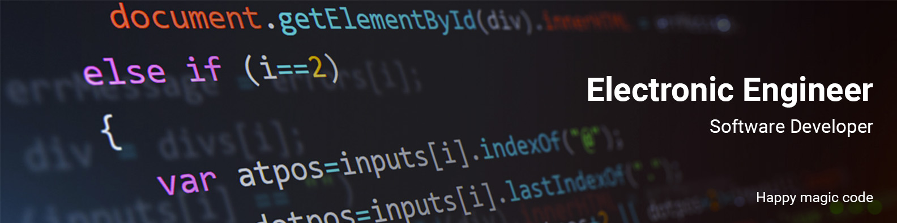

# logging.info("Hi, I'm Felipe 👋")

<a href="test.com">
    
</a>

<br /><br />

👨‍🎓 Ingeniero Electrónico de [*Universidad Sergio Arboleda*](https://www.usergioarboleda.edu.co/)

🔭 Software Developer en [*Konyu*](http://www.konyu.com.co/)


[](https://www.linkedin.com/in/andres-felipe-diaz-rodriguez-835780123/)


Hola soy Felipe Diaz un ingeniero electrónico al que le gusta mucho el café ☕, salir, viajar y conocer gente nueva que comparta mis metas y me acompañe en cumplir mis retos 🚀. Tengo una gran pasión por aprender “sobre todo programación”, leer libros muy Geeks, hacer deporte 🥇, ver Esports y ¡claro! Jugar videojuegos. Si quieres aprender tengo unos repositorios dedicados a las pequeñas cosas que he aprendido sobre los distintos lenguajes en mi Github así que ¡Bienvenido! 🤙🏽

### Un poco mas sobre mi 🧙‍♂️
```javascript
const Felipe = {
    pronouns: "he" | "him",
    code: ["Python", "Dart", "C++", "JavaScript"],
    frameworks: ["ReactJs", "Flutter", "Django", "Qt"]
    tools: ["Docker", "Nginx", "Kubernetes", "Zsh"],
    arquictecture: ["serverless", "microservices"],
    cloud: {
        "Azure": ["Azure functions", "Virtual machines", "WebApp", "Application Insights"],
        "Amazon": ["EC2", "S3", "EMR", "Lambda Functions"],
        "Google": ["",""]
    },
    services: {
        "Firebase": ["RealTime Database", "Firebase Authentication", "Firebase Cloud Messagging", "Firebase Crashlytics"]
    },
    ia: ["ChatGPT", "MidJourney", "Stable Diffusion", "OpenCV", "Keras", "TensorFlow", "SKLearn"],
    challenge: {
        "2020": "Improve my skills in cloud computing and python",
        "2021": "Become a fullstack developer",
        "2022": "Learn mobile development",
        "2023": "Improve my skills in artificial intelligence development"
    }
}
```


